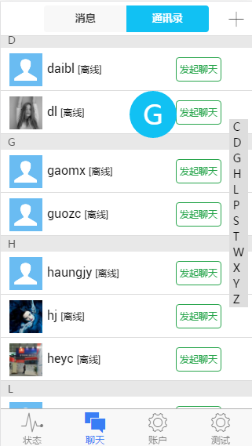

# Ionic-Chat
a chat app based on ionic and rongyun
> This project is underdevelop and it is unrunnable for the time being.

## Features
* server code and fe code are both provided
* automatically build dev&prod with gulp
* support unit&e2e test with karma&jamine and protractor


## File structure
   ```javascript
   ProjectName/
    ├── hooks/
    ├── node_modules/
    ├── platforms/
    ├── plugins/
    ├── scss
    │   ├── ionic.app.scss
    │   └── ...
    ├── server/
    ├── www/
    │   ├── assets/
    │   ├── prod/
    │   ├── dist/dev/static
    │   ├── lib/
    │   ├── gulp/
    │   │   ├── tasks/
    │   │   ├── gulp.config.js
    │   │   ├── karma.conf.js
    │   │   ├── protratcor.conf.js
    │   │   ├── index.js
    │   │   └── README.md
    │   ├── module/
    │   │    ├── common/
    │   │    │    ├── js/
    │   │    │    │    ├── config.js
    │   │    │    │    └── ...
    │   │    │    ├── css/
    │   │    │    └── tpl/
    │   │    ├── app/ (entry)
    │   │    ├── modulename/
    │   │    │    ├── directives/
    │   │    │    ├── pages/
    │   │    │    ├── css/
    │   │    │    ├── js/
    │   │    │    │    ├── modulename.controller.js
    │   │    │    │    ├── modulename.directive.js
    │   │    │    │    ├── modulename.filter.js
    │   │    │    │    ├── modulename.module.js
    │   │    │    │    ├── modulename.route.js
    │   │    │    │    └── modulename.service.js
    │   │    │    └── tpl/
    │   │    └── ...
    │   ├── index_dev.html
    │   ├── index.html
    │   └── manifest.json
    ├──  config.xml
    ├──  ionic.project
    ├──  package.json
    ├──  gulpfile.js
    ├──  bower.json
    ├── .bowerrc
    ├── .editorconfig
    ├── .gitignore
    ├──  README.md
    └──  LICENSE
   ```

## Back-End dependency
you may click [build notes](server/README.md) for more information.

1. node with express
2. mongodb with mongoose
3. redis with redis-connection
4. rongyuncloud cordova plugin
5. turn/stun server
6. socket.io

## How to run
1. install node/redis/mongodb
2. set up the enviroment for android/ios
3. install ionic. please follow the instrunction on [ionicframework](http://ionicframework.com/getting-started/)
4. git clone https://github.com/pengkobe/ionic-chat.git
5. cd /path/to/ionic-chat
6. ionic platform add android/ios
7. ionic build android/ios
8. ionic emulate android/ios


## How to run/debug on web browser
looks a little complicated here. just for your purpose of ajusting styles.
will support one key set soon.
+ userindex.js
```javascript
//initRong.init(user.rongyunToken);
```

+ contacts
```javascript
 //init();
 initTest();
```

+ chatDetail
```javascript
 // init();
```

+ just follow these commands
```bash
# notice : you should open your mongodb and redis service first
cd path/to/ionic-chat/server
node bin/www
cd ..
ionic serve
```

## Doing
1. ~~hot update~~
2. ~~localstorage policy~~
3. server push
4. ~~jwt~~

## Todo
1. lazy load( for H5 )
2. ~~compress js( special config for angular )~~
3. make it beautiful and stable

## Demo
a little glimpse of ionic-chat on Chrome:


## Licence
MIT@[pengkobe](yipeng.info)
